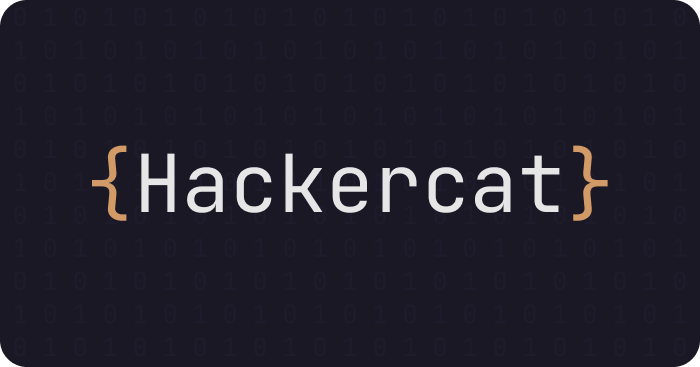

<p align="center">
  
</p>

### Prerequisites

Before running this bot, make sure you have created a bot in the Discord Developer Portal. Follow these steps:

1. **Create a Bot in the Discord Developer Portal**
    - Visit [Discord Developer Portal](https://discord.com/developers/applications)
    - Create a new application.
    - Give your bot a name and customize other settings as needed.
  
2. **Grant Privileged Intents**
    - In the "Bot" section of your application, under the "Privileged Gateway Intents" section, enable all three Intents.

3. **Reset and Save Bot Token**
    - In the "Bot" section of your application, under the bot username, there's an option to reset the token. Reset the token and be sure to copy and securely store this token as you'll need it to run the bot script.

4. **Invite the Bot to Your Server**
    - Go to the "OAuth2 URL Generator" tab in your application.
    - select "scopes": "bot" and "bot permissions": "administrator".
    - Copy the generated link and paste it into your browser. Use this link to invite the bot to your server.

### Setup Steps

1. **Install Git**
    - **For Windows (using winget)**
        ```bash
        winget install git
      ```
    - **For Linux (Debian/Ubuntu)**
        ```bash
        sudo apt-get install git
      ```
    - **For macOS (using Homebrew)**
        ```bash
        brew install git
      ```

2. **Clone Repository**
    - Download the repository via the command line:
        ```bash
        git clone https://github.com/Plompi/Hackercat.git
      ```

3. **Navigate to Repository Directory**
    - Access the repository directory using the command line:
        ```bash
        cd Hackercat
      ```

4. **Install Requirements**
    - Use the following command to install the required modules:
        ```bash
        pip install -r requirements.txt
      ```

5. **Run the Bot**
    - Execute the `Bot.py` file to enter the Bot Token and start your bot:
        ```bash
        python Bot.py
      ```